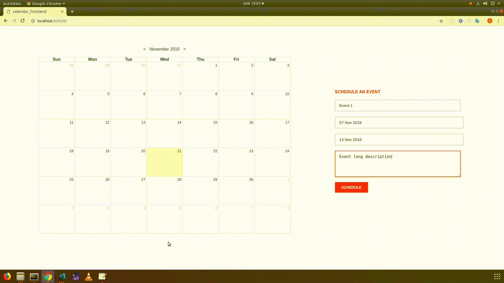

### Getting Started

This is a vuejs front-end example calendar. You can have a look at the video below. You can find the back-end example chat made with vuejs at https://github.com/cannyedge34/calendar-back-end.git



This project was bootstrapped with Vuejs. It is not tested in production environment, it is just an example app. So, use it under your responsibility.

## Build Setup

``` bash
# install dependencies
yarn install

# serve with hot reload at localhost:8080
yarn start
